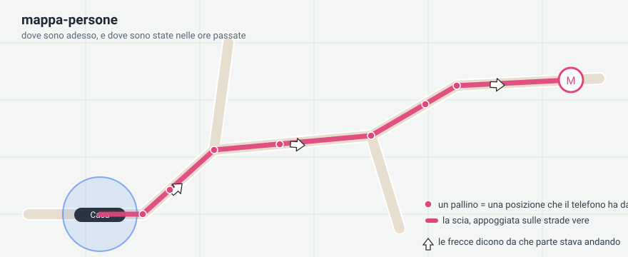
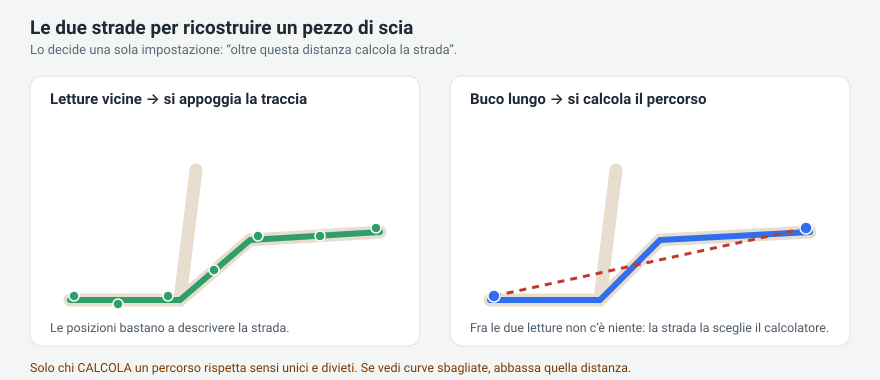
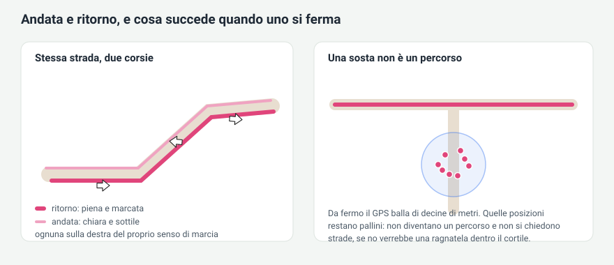

# mappa-persone

Una scheda per Home Assistant che mostra **dove sono le persone adesso e dove sono state**,
con la scia appoggiata sulle strade vere invece che tirata dritta attraverso i campi.

> 🇬🇧 This document is also available **[in English](README.md)**.
> La scheda parla italiano quando Home Assistant è in italiano, e inglese nel resto del mondo.



---

## Cosa fa

* Disegna persone, tracciatori e zone su una mappa OpenStreetMap.
* Mostra la **scia delle ore passate**: un pallino per ogni posizione che il telefono ha
  davvero mandato, e la linea che le unisce.
* Se vuoi, **appoggia quella linea sulle strade vere**, rispettando i sensi unici, e riempie
  i buchi lasciati quando il telefono tace.
* Distingue **andata e ritorno** e li disegna affiancati come due corsie, ognuna con le sue
  frecce del senso di marcia.
* Riconosce le **soste**: stare fermi non è un viaggio, quindi non viene trasformato in un
  percorso.
* Le zone hanno il loro raggio vero, un'icona o la foto del posto, e il nome leggibile.
* Le persone vicine fra loro diventano un pallino solo, che si **apre a ventaglio** toccandolo.

Niente viene conservato fuori dal tuo Home Assistant. Le uniche richieste che escono dalla
tua rete sono le piastrelle della mappa e, se lo accendi, il calcolo delle strade: vedi la
sezione [Privacy](#privacy).

---

## Installazione

### Con HACS (deposito personalizzato)

1. HACS → tre puntini → **Depositi personalizzati**
2. Deposito: `https://github.com/cash83/mappa-persone`, categoria **Dashboard**
3. Installa, poi ricarica il browser.

### A mano

1. Scarica l'ultima release e copia il contenuto di **`dist/`** dentro
   `config/www/community/mappa-persone/` (tutti i file `.js` piu' `leaflet.js`
   e `leaflet.css`, uno accanto all'altro, senza sottocartelle).
2. Impostazioni → Dashboard → tre puntini → **Risorse** → aggiungi
   `/local/community/mappa-persone/mappa-persone.js` come **modulo JavaScript**.
3. Ricarica il browser con ctrl+shift+R.

---

## La configurazione minima

```yaml
type: custom:mappa-persone
entities:
  - entity: person.anna
  - entity: zone.home
```

Basta questo. Tutto il resto ha un valore di partenza ragionevole, e si può regolare dalla
finestra delle impostazioni: ogni casella ha la sua spiegazione sotto.

Un esempio più completo:

```yaml
type: custom:mappa-persone
ore: 12                 # quante ore di scia mostrare
sfondo: satellite       # sfondo della mappa
ingrandimento: 16       # quanto può stringere quando si inquadra da sola
aggancio: stadia        # chi calcola le strade: no | stadia
stadia_chiave: xxx      # la chiave di Stadia Maps, se l'aggancio e' acceso
entities:
  - entity: person.anna
    colore: deep-purple
    via_salto: 120      # oltre 120 m calcola la strada invece di agganciare
    fermo_m: 100        # sotto 100 m di spostamento è ferma
    sosta_linea: 0      # nessuna linea dentro le soste, solo i pallini
  - entity: person.marco
    colore: green
    scosto: 20          # quanto separare andata e ritorno
  - entity: zone.home
    foto: /local/casa.jpg
    opacita: 50
```

---

## Come viene ricostruita la scia

È la parte che vale la pena capire, perché una sola impostazione decide tutto.

Un telefono non manda una linea continua. Manda dei **punti**, che cadono a qualche metro
dalla strada, e ogni tanto tace per minuti. Per disegnare una scia la scheda deve riempire lo
spazio fra un punto e il successivo, e può farlo in due modi diversi.



* **Sotto `via_salto`** i punti sono abbastanza vicini da descrivere la strada da soli, quindi
  la scheda *appoggia la traccia* sulla rete stradale.
* **Sopra `via_salto`** c'è un buco vero, quindi la scheda *calcola il percorso* fra i due punti.

La differenza conta più di quanto sembri: **chi calcola un percorso rispetta sensi unici e
divieti, chi appoggia la traccia no**. Una traccia appoggiata ogni tanto finisce su una
stradina privata, o fa fare il giro di una rotonda. Quindi se vedi curve sbagliate,
**abbassa `via_salto`**: a 120 metri più tratti vengono calcolati e la scia rispetta le regole
della strada.

Ogni percorso calcolato passa poi da un freno: se viene fuori molto più lungo della linea
d'aria (`via_giro`, di serie 200%) viene buttato e si disegna una riga dritta. Meglio una riga
dritta onesta di un giro inventato.

Prima di arrendersi alla riga dritta la scheda fa due tentativi in più, e solo per quel
tratto: lo richiede dicendo **in che direzione si stava andando** (su una strada a due
carreggiate evita il giro fino allo svincolo), e poi **come pullman** (un senso unico che i
mezzi pubblici possono fare al contrario, una corsia riservata). La risposta si tiene solo se
sta sotto il freno, quindi non può peggiorare niente.

### Quanto costa a Stadia

Basta il **piano gratuito** di Stadia Maps (200.000 crediti al mese, 20 per richiesta). Quel
piano ha solo i percorsi e non l'aggancio vero e proprio (`map_match`), quindi la scheda
descrive anche i tratti fitti come una fila di tappe; chi ha un piano con l'aggancio continua
a usarlo, la scheda se ne accorge da sola.

Un viaggio intero viene spedito in un flusso solo, quaranta posizioni per richiesta: un giro
di 80 km sono una quindicina di richieste, un tragitto casa-scuola una o due. Si paga **una
volta per browser**: i viaggi finiti restano in memoria tre giorni e riaprire la mappa non
costa niente. Un viaggio guardato mentre succede costa circa una richiesta ogni cinque minuti.
Con quattro persone tracciate si resta intorno a un decimo del piano gratuito.

### Soste, corsie e frecce



Un telefono fermo manda comunque centinaia di posizioni che ballano di decine di metri. Se in
tutto un tratto non si allontana mai più di `fermo_m`, quella è una **sosta** e non un viaggio:
tiene i suoi pallini ma non viene mai trasformata in un percorso. Se no verrebbe una ragnatela
di righe in mezzo al cortile.

Andata e ritorno si disegnano affiancati, ognuno sulla destra del proprio senso di marcia, con
la propria fila di frecce, così non si accavallano nemmeno sulla stessa strada.

### Le letture consegnate in ritardo

Ogni tanto il telefono tiene in pancia una posizione e la manda **dopo** una più recente. Nella
fila diventa un andirivieni — avanti, indietro, avanti — e il calcolatore, per passare da tutte
e tre, infila cortili e stradine di servizio. La scheda la riconosce e la toglie dal calcolo,
ma solo se è arrivata davvero **fuori cadenza**: buco lungo prima, la successiva subito dietro.
Chi il giro l'ha fatto per davvero manda alla sua solita cadenza, e la sua scia lo segue anche
quando torna sui propri passi. In tutti e due i casi **i pallini restano tutti**: quello che
viene scartato è solo il suggerimento su dove far passare la linea.

---

## Tutte le impostazioni

### Della scheda

| Voce | Di serie | Cosa fa |
|---|---|---|
| `entities` | — | L'elenco di persone, tracciatori e zone da disegnare |
| `ore` | `12` | Quante ore di scia mostrare. `0` = solo dove sono adesso |
| `sfondo` | `satellite` | `stradale`, `scuro`, `satellite`, `topografico` |
| `ingrandimento` | `16` | Quanto può stringere quando si inquadra da sola |
| `gruppo_opacita` | `100` | Quanto si vede il pallino di gruppo |
| `aggancio` | `stadia` | Chi calcola le strade: `no` oppure `stadia`. Vale per tutti. Senza chiave restano le righe dritte |
| `stadia_chiave` | — | La chiave di [Stadia Maps](https://stadiamaps.com), gratuita per uso non commerciale |

### Di ogni persona o tracciatore

| Voce | Di serie | Cosa fa |
|---|---|---|
| `colore` | tema | Colore della scia e dell'icona |
| `dim` | `40` | Grandezza dell'icona in pixel |
| `opacita` | `100` | Quanto è piena l'icona |
| `foto` | — | Una foto per l'icona, al posto di quella di Home Assistant |
| `profilo` | `automatico` | `automatico`, `piedi`, `bici`, `auto`, `bus` (col pullman i tratti a piedi li riconosce lo stesso) |
| `via_salto` | `160` | Oltre questa distanza (m) calcola la strada invece di agganciare |
| `via_giro` | `200` | Di quanto (%) può allungare un percorso calcolato prima di essere buttato |
| `usa_indirizzo` | `false` | Usa anche il sensore dell'indirizzo come fonte |
| `fermo_m` | `100` | Sotto questo spostamento (m) è una sosta, non un viaggio |
| `pausa_min` | `5` | Minuti da fermo che chiudono un viaggio |
| `andata_ritorno` | `true` | Distingui andata e ritorno |
| `scosto` | `8` | Distanza (px) fra due corsie vicine; da lontano la corsia più esterna non supera il doppio in metri. Con più persone vale il più piccolo fra quelli impostati |
| `spessore` | `4` | Spessore della scia |
| `alone` | `true` | Disegna l'alone della precisione del GPS |
| `frecce` | `true` | Frecce del senso di marcia |
| `frecce_colore` | bianco | Colore delle frecce |
| `pallini` | `true` | Segna ogni posizione ricevuta |
| `pallini_dim` | `9` | Grandezza dei pallini |
| `passo_pallini` | `10` | Tieni i pallini distanti almeno (m). `0` = tutti |
| `sosta_linea` | `0` | Linea dentro le soste (m). `0` = nessuna, `100` = un trattino |
| `sfuma` | `true` | Sbiadisci le parti più vecchie |

### Di ogni zona

| Voce | Di serie | Cosa fa |
|---|---|---|
| `mostra` | `true` | Disegna questa zona |
| `nome` | da HA | Nome scritto dentro il cerchio |
| `icona` | da HA | Icona dentro il cerchio |
| `foto` | — | Una foto del posto, che riempie tutto il cerchio |
| `colore` | grigio | Colore del cerchio e del bordo |
| `dim` | `40` | Grandezza dell'icona (la foto riempie sempre il cerchio) |
| `opacita` | `100` | Quanto è piena |

Il cerchio della zona usa sempre il **raggio vero** impostato in Home Assistant.

---

## Consigli

* **La scia sembra fatta di corde dritte.** Il telefono manda troppo di rado. Controlla
  l'app companion: posizione su *Consenti sempre*, ottimizzazione batteria disattivata. Su
  parecchi telefoni Android la posizione in secondo piano viene strozzata dal sistema, e la
  soluzione documentata è l'*alta precisione* dell'app stessa.
* **Curve sbagliate vicino agli incroci.** Abbassa `via_salto`, prova 120.
* **Giri inventati.** Abbassa `via_giro`. Troppe righe dritte invece? Alzalo.
* **Una ragnatela di righe dove uno parcheggia.** Metti `sosta_linea` a `0`, oppure a `100`
  per un trattino solo che collega l'entrata all'uscita.
* **La scia salta un pallino.** Se il pallino è isolato e la linea gli passa lontano, di solito
  è una posizione arrivata in ritardo, scartata apposta (vedi sopra). Se invece i pallini
  saltati sono in fila e descrivono una strada vera, è un problema: aprine una segnalazione
  con l'ora, servono le letture di quel tratto.
* **Pallini dove la persona non è mai stata.** Spegni `usa_indirizzo`: su certi telefoni il
  sensore dell'indirizzo risponde sempre con gli stessi due o tre punti fissi.
* **Dopo un aggiornamento non cambia niente.** Ricarica con ctrl+shift+R: il browser tiene in
  cache la scheda.

---

## Privacy

* Le piastrelle della mappa arrivano da Esri, quindi quelle che guardi vengono
  chieste a loro. Il fondo di serie NON usa i server di volontari di OpenStreetMap: quelli chiedono che chi
  li interroga si faccia riconoscere, e dal browser una scheda non puo'.
* Il tasto **Mappa** dentro il cartellino di una persona apre una mappina con gli stessi
  tasselli di Esri, e non manda la posizione a nessun altro. Solo il collegamento *Apri in
  Google Maps*, se lo tocchi, apre Google con **la posizione di quella persona in quel
  momento**.
* L'aggancio alle strade, quando è acceso, manda le **coordinate della scia** a
  [Stadia Maps](https://stadiamaps.com), col tuo account. Con `aggancio: no` non esce niente
  dalla tua rete e le scie restano righe dritte.
* Le scie calcolate vengono tenute nel tuo browser per tre giorni, così lo stesso viaggio non
  viene richiesto due volte. Non vanno da nessun'altra parte e non escono da Home Assistant.

---

## Ringraziamenti

Tasselli della carta stradale, del satellite, della mappa scura e topografica © Esri.
Calcolo delle strade con [Valhalla](https://valhalla.readthedocs.io), servito da
[Stadia Maps](https://stadiamaps.com), su dati © [OpenStreetMap](https://www.openstreetmap.org/copyright):
quando l'aggancio è acceso tutti e due sono nominati anche sulla mappa, accanto a Esri.
Mappa disegnata con [Leaflet](https://leafletjs.com) 1.9.4, incluso in `leaflet/` con la sua
licenza BSD-2 (`leaflet/LICENSE`).

Distribuita con [licenza MIT](LICENSE).
