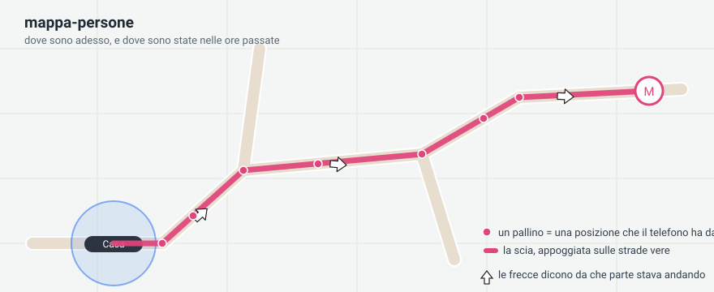
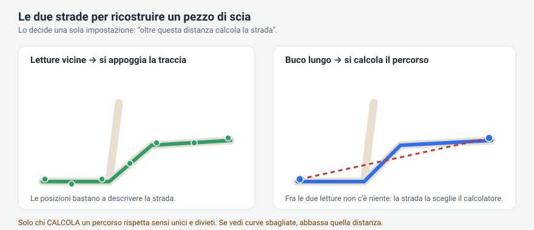
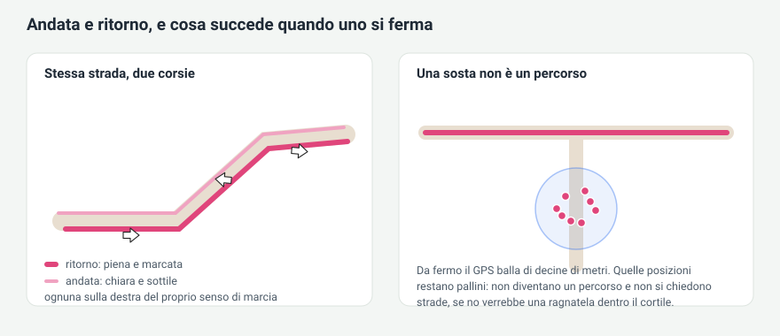

# mappa-persone

A Home Assistant Lovelace card that shows **where people are now and where they have been**,
with the trail snapped onto the real roads instead of cutting across fields.

> 🇮🇹 Questo documento è disponibile anche **[in italiano](README.it.md)**.
> The card itself speaks Italian when Home Assistant does, and English everywhere else.



---

## What it does

* Draws people, device trackers and zones on an OpenStreetMap map.
* Shows the **trail of the past hours**: one dot for every position the phone actually
  reported, and a line joining them.
* Optionally **snaps that line onto the real roads**, respecting one-way streets, and fills
  the gaps left when the phone goes quiet.
* Tells **outbound from return** and draws them side by side like two lanes, each with its
  own direction arrows.
* Recognises **stops**: standing still is not a trip, so it is not turned into a route.
* Zones get their real radius, an icon or a photo of the place, and a readable name.
* People standing close together collapse into one badge that **fans out** when you tap it.

Nothing is stored outside your Home Assistant. The only requests that leave your network are
the map tiles and, if you turn it on, the road routing — see [Privacy](#privacy).

---

## Install

### Through HACS (custom repository)

1. HACS → three dots → **Custom repositories**
2. Repository: `https://github.com/cash83/mappa-persone`, category **Dashboard**
3. Install, then reload your browser.

### By hand

1. Download the latest release and copy the contents of **`dist/`** into
   `config/www/community/mappa-persone/` (all the `.js` files plus `leaflet.js`
   and `leaflet.css`, side by side, no subfolders).
2. Settings → Dashboards → three dots → **Resources** → add
   `/local/community/mappa-persone/mappa-persone.js` as a **JavaScript module**.
3. Reload your browser with ctrl+shift+R.

---

## Minimal configuration

```yaml
type: custom:mappa-persone
entities:
  - entity: person.anna
  - entity: zone.home
```

That is enough. Everything else has a sensible default, and the whole card can be configured
from the visual editor — every field has its own explanation underneath.

A fuller example:

```yaml
type: custom:mappa-persone
ore: 12                 # hours of trail to show
sfondo: stradale        # map background
ingrandimento: 16       # how far it may zoom in when framing itself
aggancio: valhalla      # who works out the roads: no | valhalla | osrm
entities:
  - entity: person.anna
    colore: deep-purple
    via_salto: 120      # beyond 120 m, compute the road instead of snapping
    fermo_m: 100        # below 100 m of displacement they are stopped
    sosta_linea: 0      # no line inside stops, only dots
  - entity: person.marco
    colore: green
    scosto: 20          # how far apart to draw outbound and return
  - entity: zone.home
    foto: /local/casa.jpg
    opacita: 50
```

---

## How the trail is rebuilt

This is the part worth understanding, because one setting decides everything.

A phone does not report a continuous line. It reports **points**, a few metres off the road,
and every so often it goes quiet for minutes. To draw a trail the card has to fill the space
between one point and the next, and it can do it in two different ways.



* **Below `via_salto`** the points are close enough to describe the road themselves, so the
  card *snaps the trace* onto the road network.
* **Above `via_salto`** there is a real gap, so the card *computes a route* between the two
  points.

The difference matters more than it looks: **computing a route respects one-way streets and
access restrictions, snapping a trace does not**. A snapped trace occasionally lands on a
private lane or sends the trail around a roundabout. So if you see wrong turns, **lower
`via_salto`** — at 120 m more stretches get computed and the trail obeys the rules of the road.

Every computed route then passes a brake: if it comes out much longer than the straight line
(`via_giro`, default 200%), it is thrown away and a straight line is drawn instead. Better an
honest straight line than an invented detour.

### Stops, lanes and arrows



A stationary phone still reports hundreds of positions that wander by tens of metres. If over
a whole stretch it never gets further than `fermo_m`, that is a **stop**, not a trip: it keeps
its dots but is never turned into a route. Otherwise you would get a cobweb of lines across
the courtyard.

Outbound and return are drawn side by side, each on the right of its own direction of travel,
with their own row of arrows, so the two never overlap even on the same road.

---

## Options

### Card

| Option | Default | What it does |
|---|---|---|
| `entities` | — | The list of people, trackers and zones to draw |
| `ore` | `12` | How many hours of trail to show. `0` = only where they are now |
| `sfondo` | `stradale` | `stradale`, `scuro`, `satellite`, `vie`, `topografico` |
| `sfondo_cartellino` | `satellite` | Background of the mini map inside the popup |
| `ingrandimento` | `16` | How far it may zoom in when framing itself |
| `gruppo_opacita` | `100` | How visible the group badge is |
| `aggancio` | `no` | Who works out the roads: `no`, `valhalla`, `osrm` |

### Per person or tracker

| Option | Default | What it does |
|---|---|---|
| `colore` | theme colour | Trail and icon colour |
| `dim` | `40` | Icon size in pixels |
| `opacita` | `100` | How solid the icon is |
| `foto` | — | A photo for the icon, instead of the one from Home Assistant |
| `via` | `true` | Snap this person's trail onto the roads |
| `profilo` | `automatico` | `automatico`, `piedi`, `bici`, `auto`, `bus` |
| `via_salto` | `160` | Beyond this distance (m), compute the road instead of snapping |
| `via_giro` | `200` | How much longer (%) a computed route may be before it is rejected |
| `usa_indirizzo` | `false` | Also use the geocoded location sensor as a source |
| `fermo_m` | `100` | Below this displacement (m) it is a stop, not a trip |
| `pausa_min` | `5` | Minutes stopped that close a trip |
| `andata_ritorno` | `true` | Tell outbound from return |
| `scosto` | `8` | How far apart (px) to draw the two lanes |
| `spessore` | `4` | Trail thickness |
| `alone` | `true` | Draw the GPS accuracy halo |
| `frecce` | `true` | Direction arrows |
| `frecce_colore` | white | Arrow colour |
| `pallini` | `true` | Mark every position received |
| `pallini_dim` | `9` | Dot size |
| `passo_pallini` | `0` | Keep dots at least this far apart (m). `0` = all of them |
| `sosta_linea` | `0` | Line inside stops (m). `0` = none, `100` = one short segment |
| `sfuma` | `true` | Fade the older parts |

### Per zone

| Option | Default | What it does |
|---|---|---|
| `mostra` | `true` | Draw this zone at all |
| `nome` | from HA | Name written inside the circle |
| `icona` | from HA | Icon inside the circle |
| `foto` | — | A photo of the place, filling the whole circle |
| `colore` | grey | Circle and border colour |
| `dim` | `40` | Icon size (a photo always fills the circle) |
| `opacita` | `100` | How solid it is |

The zone circle always uses the **real radius** set in Home Assistant.

---

## Tips

* **Trail looks like straight chords.** Your phone is reporting too rarely. Check the
  Home Assistant companion app: location permission on *Allow all the time*, battery
  optimisation off. On several Android phones background location is throttled hard by the
  system; the app's own *high accuracy mode* is the documented workaround.
* **Wrong turns near junctions.** Lower `via_salto` (try 120).
* **Invented detours.** Lower `via_giro`. Too many straight lines instead? Raise it.
* **A cobweb of lines where someone parks.** Set `sosta_linea` to `0`, or to `100` for a
  single short segment linking the way in to the way out.
* **Dots where the person has never been.** Turn `usa_indirizzo` off: on some phones the
  geocoded sensor always answers with the same two or three fixed points.
* **Nothing updates after an upgrade.** Reload with ctrl+shift+R — the browser caches the card.

---

## Privacy

* Map tiles come from Esri, so the tiles you look at are requested from them. The
  default background does NOT use the volunteer OpenStreetMap servers: those ask whoever queries them to identify itself, and a
  card running in a browser cannot.
* Road snapping, when enabled, sends the **coordinates of the trail** to the public
  [Valhalla](https://valhalla1.openstreetmap.de) or [OSRM](https://router.project-osrm.org)
  servers. With `aggancio: no` nothing ever leaves your network and trails stay straight lines.
* Computed trails are cached in your browser for three days so the same trip is not requested
  again. Nothing is sent anywhere else, and nothing is stored outside your Home Assistant.

---

## Credits

Map data © [OpenStreetMap](https://www.openstreetmap.org/copyright) contributors, street, satellite and dark tiles © Esri.
Routing by [Valhalla](https://valhalla.readthedocs.io) and
[OSRM](https://project-osrm.org). Map rendering by [Leaflet](https://leafletjs.com) 1.9.4, bundled in `leaflet/` under its own BSD-2 licence.

Released under the [MIT licence](LICENSE).
